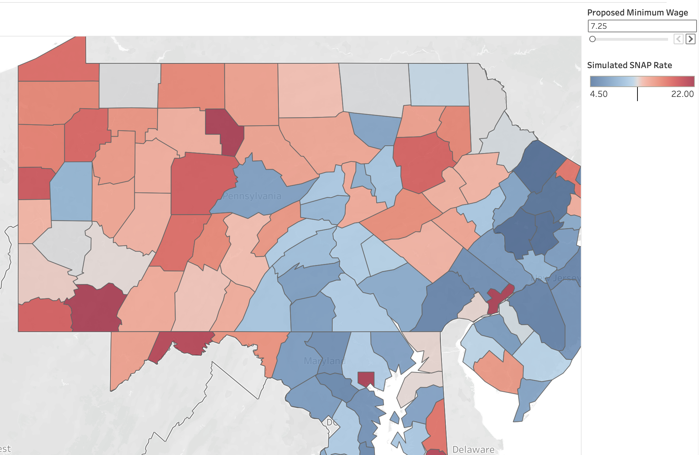

# Tri-State-Economic-Policy-Welfare-Analysis
This public policy research analyzes the relationship between statutory minimum wage changes, housing costs, and (SNAP) reliance.
Tri-State Economic Policy & Welfare Analysis

# Project Overview
This public policy research project analyzes the relationship between minimum wage changes, housing costs, and Supplemental Nutrition Assistance Program (SNAP) reliance. By using data across 112 counties in Pennsylvania, New Jersey, and Maryland, this project models how localized cost of living influences the purchasing power of minimum and low-wage workers.

# 🗺️ Tri-State Economic Policy & Welfare Analysis Pipeline

### Click the map preview below to launch the live, interactive Tableau Dashboard:

Move the minimum wage slider on the web dashboard to simulate real-time wage adjustments and track adjustments to housing budens and SNAP reliance across our 112 mapped counties.

Findings (Lancaster County, PA)
tatus Quo Real Baseline: Median Rent: $1,221.00 | Median Income: $81,458.00 | Status Quo SNAP Rate: 8.11%
The 30% Housing Affordability: A full-time 40-hour worker requires an annual gross income of $48,840.00 to afford Lancaster's median rent.
The Target Living Wage**: The minimum wage threshold required to guarantee housing security and drive down SNAP dependence is $23.48/ hour.

# The Core Components
1. Python `simulate_policy.py` Utilizes the official `census` to extract data strings, training a Random Forest Regressor to model welfare (0.82 R² Score).
2. R Econometrics `welfare_regression.R` OLS linear regression model to compute p-value significance markers across the data (0.70 Multiple R²).
3. Tableau Public Viz - Deploys an interactive map allowing policymakers to simulate custom minimum wage targets alongside 30% Housing Cost Burden calculations.

Packages
Python 3.11, R Language
`pandas`, `numpy`, `scikit-learn` (Random Forest), `census`
`stats` (`lm` modeling architectures)
Tableau Public
